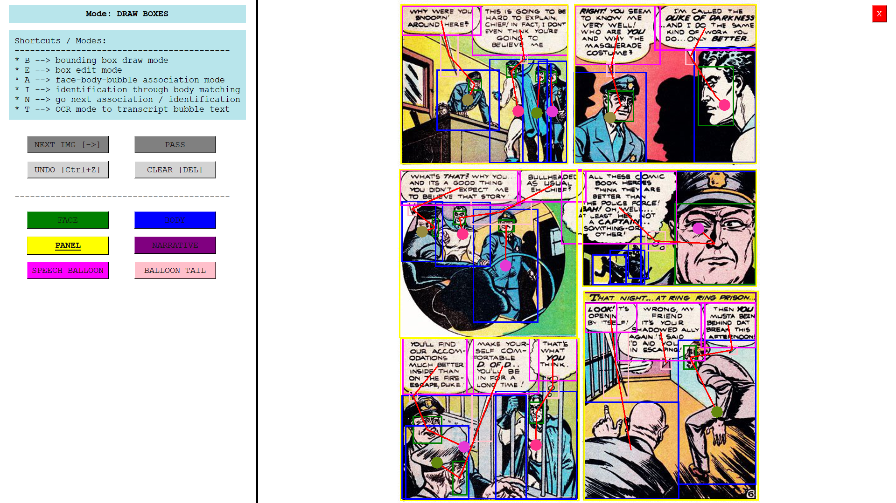

# ComicAnnotator

An annotation tool for comics. Written in Tkinter, configured for panel, face, body, speech bubble, and narrative annotation.

## Features

- **Annotate** images with face, body, panel, speech bubble, narrative, and speech bubble tail bounding boxes.
- **Shift and resize** the drawn boxes with the edit mode.
- Add **associations** between faces, bodies, speech bubbles, and speech bubble tails.
- With **identification** mode, select bodies that belong to the same person (a circle appears with the same color in the center of body box).
- **Undo** changes if something is done wrong.

## Folder Structure

- Add your images to `annot_images` folder.
- Inside `meta_data` folder:
    - Place your list of image files inside the `files_list.txt` file.
    - Create a json file named `users_range.json` and define your specific conditions there (which user will see which range of images):

```json
{
    "test": [
        0,
        2
    ],
    "user1": [
        0,
        20
    ],
    ...
}
```

-   Create a `results` directory, where the annotation results are written. The annotation file name will be `results/{img_name}.png` and outputs will be in this format:

```
### BOXES
index,x1,y1,x2,y2,obj_name
...

### ASSOCIATIONS
index1,index2,index3,...
index4,index5,...

### IDENTIFICATIONS
index1,index2,index3,...
index4,index5,...
...

### TEXTS
box_id1,text1
box_id2,text2
...
```

## Usage

- Select the object to annotate,
- Long press and drag for making a bounding box,
- After finishing all the objects, press to "a",
- Associate each object by clicking on their boxes,
- When one association is finished, click to "n" for starting a new association.
- Press "e" to edit your boxes.

## Screenshot

- General View of the Application



- View During the Text Transcription Mode


## TODO

- Add gaze direction labeling
- Embed a detector model to help with the box annotation